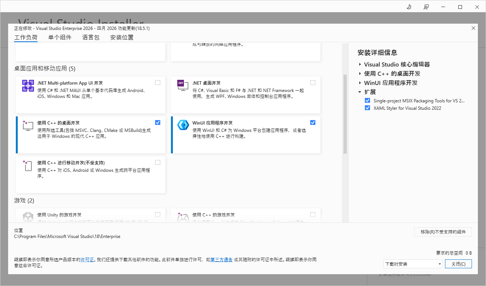

<div align="center">

[English](CONTRIBUTING-en.md) | [中文](../CONTRIBUTING.md)

</div>

# Development Environment Setup Guide

## System Requirements

- **Operating System**: Windows 10 22H2 (Build 19041) or later
- **Development Tool**: Visual Studio 2026 (Community Edition is fine)

## Development Environment Setup

### 1. Install Visual Studio Components

When installing Visual Studio 2026, please select the following workload:

- **WinUI Application Development**



### 2. Clone the Project Repository

Use Git to clone this project to your local machine:

```bash
git clone https://github.com/LanZhan-Harmony/WindowsMusicPlayer-TheUntamedMusicPlayer.git
```

### 3. Open the Project in Visual Studio

Open the `UntamedMusicPlayer.slnx` file in Visual Studio.

### 4. Restore NuGet Packages

Wait for Visual Studio to automatically restore the NuGet dependencies.

### 5. Build and Run

Click the "**▶ Untamed Music Player (Package)**" button in the toolbar to start debugging and running the application.
