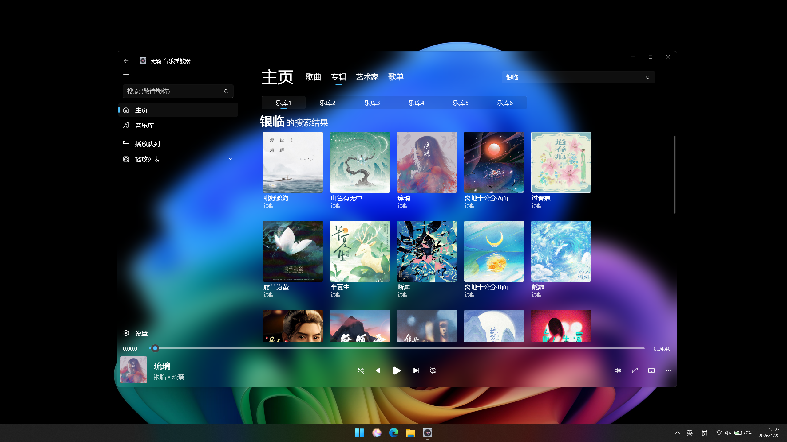
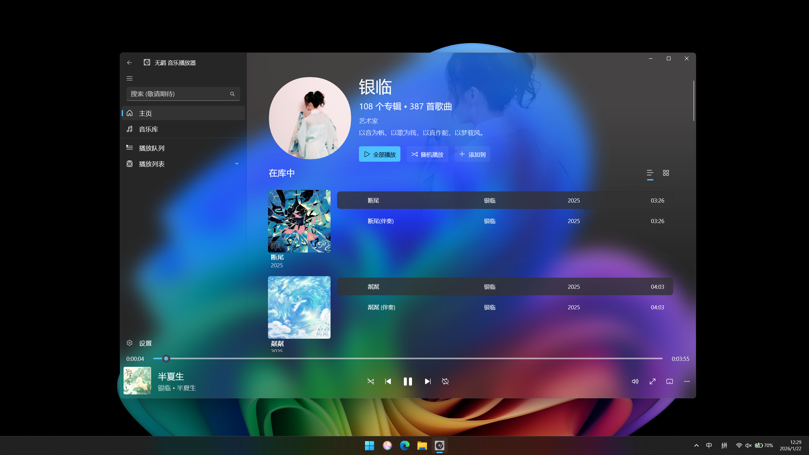
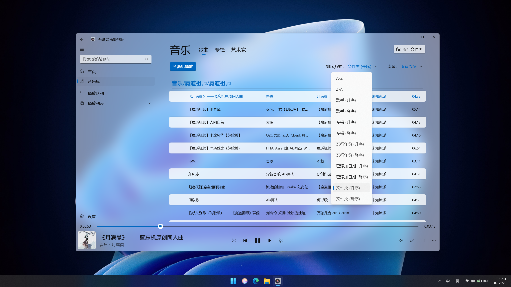
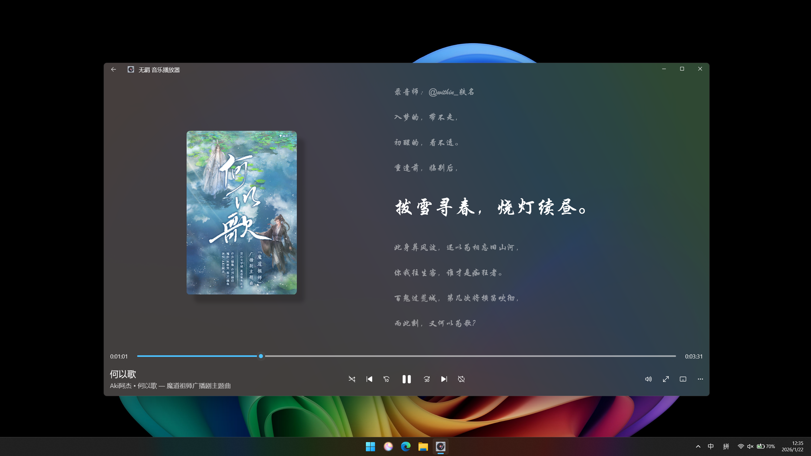
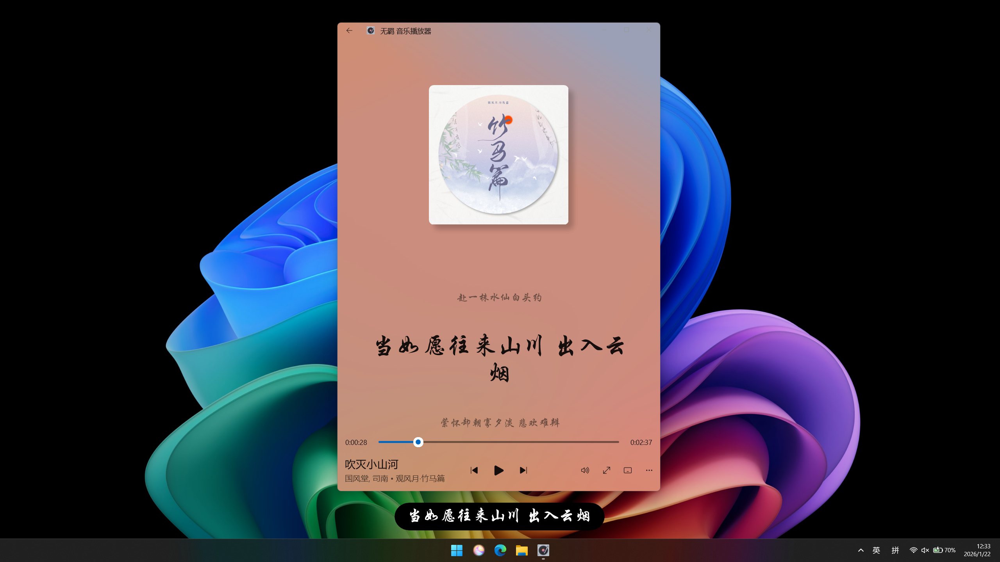
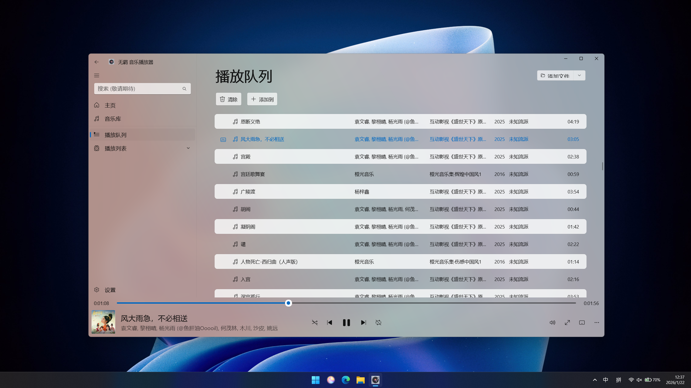
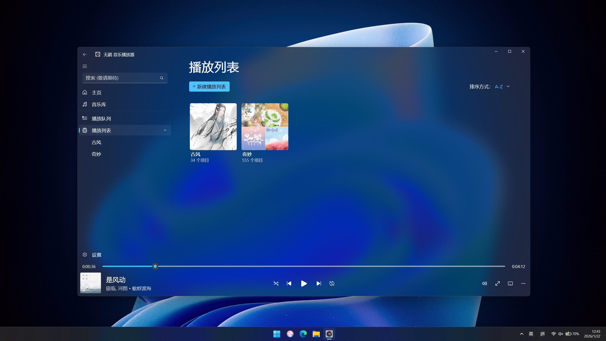
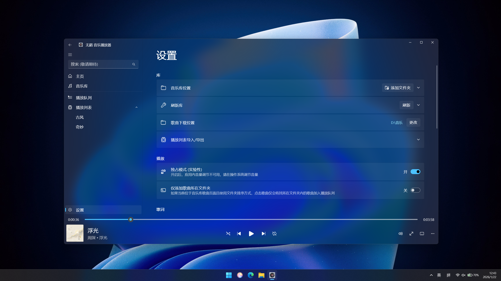

[English](README-en.md) | [中文](../README.md)

  

<h1 align="center">
  Untamed Music Player
</h1>

A modern music player for online and local music streaming

  

---

## ✨ Key Features

- 🎵 **Universal Audio Format Support** - Supports 20+ audio formats including MP3, FLAC, OPUS, OGG, and more with
  seamless switching between local and online music
- 🌐 **Online Music Search (Only supported in Chinese mainland)** - Integrated online music API supporting search,
  playback of songs, albums, playlists, and artists
- 🗂️ **Intelligent Music Management** - Multi-dimensional classification by artist, album, and playlist with M3U8
  playlist import/export support
- 📝 **Immersive Lyrics Experience** - Dual-mode lyrics display with embedded and floating options, supporting custom
  fonts
- 🎛️ **Professional Audio Control** - Built-in variable speed playback with WASAPI exclusive mode output support
- 🎨 **Exquisite Visual Design** - Multiple Mica/Acrylic material themes, cover-based dynamic backgrounds, elegant and
  modern interface
- 🔄 **Deep System Integration** - System Media Transport Control (SMTC) support, file association launch, and
  notification push
- 📋 **Flexible Queue Management** - Shuffle, single song repeat, playlist loop, and free queue editing

## 📥 Download & Installation

| Method              | Link                                                                                             | Notes                         |
|---------------------|--------------------------------------------------------------------------------------------------|-------------------------------|
| **Microsoft Store** | [Download](https://apps.microsoft.com/detail/9ncfn17f3lxj)                                       | **Recommended**, auto updates |
| **GitHub Release**  | [Download](https://github.com/LanZhan-Harmony/WindowsMusicPlayer-TheUntamedMusicPlayer/releases) | Manual installation           |
| **123 Cloud Drive** | [Download](https://www.123865.com/s/yvXSVv-j2mFd)                                                | Mirror source for China users |

### Choose the Right Version

- **x64** - For 64-bit systems (Recommended for most users)
- **ARM64** - For ARM 64-bit systems (e.g., Surface Pro X)
- **x86** - For 32-bit systems (Less common)

## 📱 Application Interface

| Preview Screenshots               |
|-----------------------------------|
|  |
|  |
|  |
|  |
|  |
|  |
|  |
|  |

## 🤝 Contributing

We welcome any form of contribution! If you have the following needs, feel free to submit:

- 🐛 **Report Bugs** - Found an issue? Please submit an Issue
- 💡 **Feature Suggestions** - Have a great idea? Open a Discussion
- 🔧 **Code Contributions** - Improve the code? Submit a Pull Request

For
detailed [contribution guidelines](https://github.com/LanZhan-Harmony/WindowsMusicPlayer-TheUntamedMusicPlayer?tab=contributing-ov-file),
please refer to our project page.

## 🙏 Acknowledgments

Special thanks to the following open-source projects and developers for their support and inspiration:

- [Disenchant UWP Music Player](https://github.com/DenryDu/Disenchant-Music-Player)
- [C# Netease Cloud Music API](https://github.com/wwh1004/NeteaseCloudMusicApi)
- [ScreenBox](https://github.com/huynhsontung/Screenbox)

## 📚 Project Dependencies

For detailed information about all dependencies and libraries used in this project, please
visit [project dependencies page](https://github.com/LanZhan-Harmony/WindowsMusicPlayer-TheUntamedMusicPlayer/network/dependencies).
